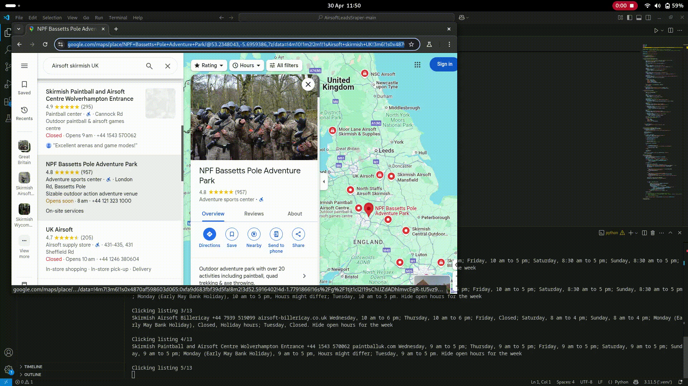

# Airsoft Leads Scraper

## Overview

**Airsoft Leads Scraper** is a tool designed to automate the process of lead generation in the airsoft domain by scraping websites, online directories, and map listings within the **UK region**. It collects data from sources such as airsoft store websites, airsoft field directories, and Google Maps, creating a structured list of leads for marketing, outreach, or analytics.

## Demo



> 📽️ _A short demo showing the scraper in action._

## Features

- ✅ Scrapes known airsoft retailers and fields within the UK  
- 🌐 Extracts data from websites, directories, and Google Maps  
- 📄 Outputs structured lead data: names, URLs, contact info, and more  
- 🔧 Modular design for easy extension to new data sources  

## Use Cases

- 📣 Marketing and lead generation for airsoft businesses  
- 🧭 Market analysis and competitor research  
- 🗺️ Mapping UK-wide airsoft activity locations  

## Installation

1. **Clone the repository**:
   ```bash
   git clone https://github.com/yourusername/AirsoftLeadsScraper.git
   cd AirsoftLeadsScraper
   python -m venv venv
   source venv/bin/activate   # On Windows: venv\Scripts\activate
   pip install -r requirements.txt
   python scraper.py

## Configuration
The scraper behavior can be configured to fit your needs:

- Target regions or search queries: adjust keywords like "airsoft site UK", "airsoft store London", etc.
- Output format: choose between CSV, JSON, or database export.
- Source control: enable/disable scrapers for specific domains.
- Configuration is currently hardcoded or stored in a config file (e.g., config.yaml) depending on implementation. Make sure to check the main script or config loader if present.

## Legal and Ethical Use
⚠️ Disclaimer

This project is provided for educational and informational purposes only. While scraping public data is generally legal in the UK, you must ensure that your activities comply with:
- The Terms of Service of any websites you scrape
- Relevant data protection regulations (e.g. UK GDPR)
- Usage rate limits and robots.txt where applicable

Do not use this tool for:
- Harvesting personal data without consent
- Overloading or attacking target servers
- Commercial purposes that violate TOS agreements

Always scrape responsibly.


## License
MIT License – see the LICENSE file for details.
